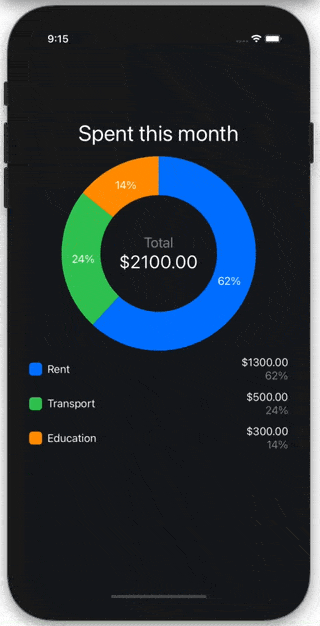
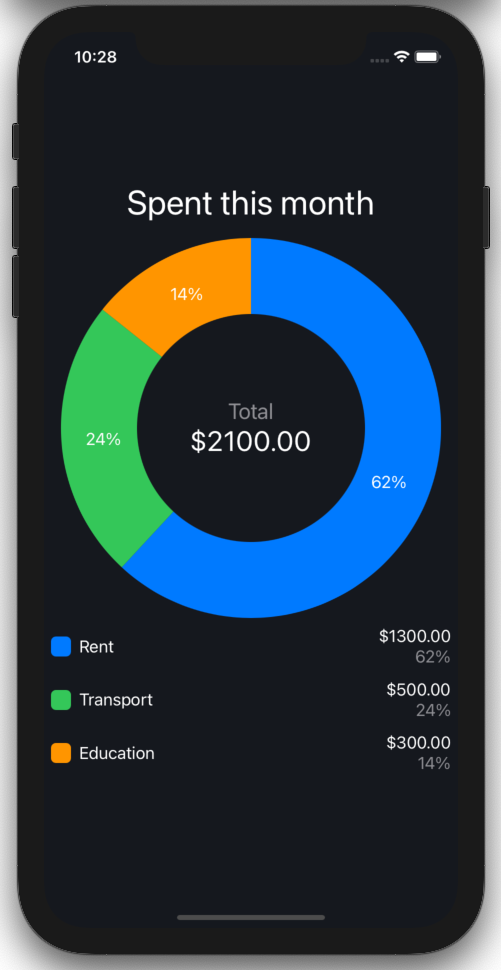
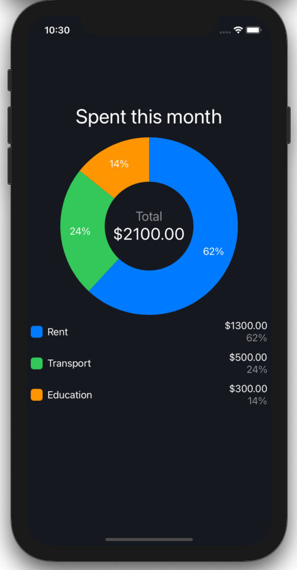
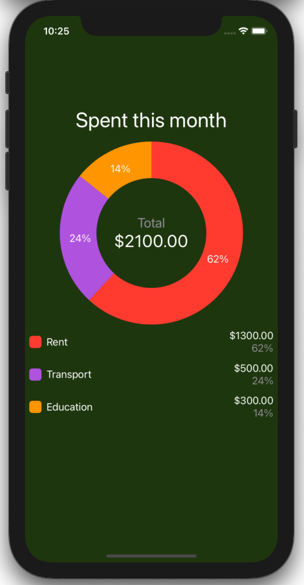

# SwiftPieChart

Simple and elegant pie chart for Swift UI



## Usage

```swift
import SwiftPieChart

...

PieChartView(
    values: [1300, 500, 300],
    names: ["Rent", "Transport", "Education"],
    formatter: {value in String(format: "$%.2f", value)})
```

`formatter` is used to format the values for displaying purposes. In the example above we are displaying values with 2 decimal places and with the `$` sign in the front.

## Installation

In Xcode go to `File -> Swift Packages -> Add Package Dependency` and paste in the repo's url: `https://github.com/ilamanov/SwiftPieChart`

## Demo

A demo iOS app shown in the gif above can be found at https://github.com/ilamanov/SwiftPieChartDemo

## Easy Customization

You can change the width of the pie chart by providing `widthFraction` parameter:
```swift
PieChartView(
    values: [1300, 500, 300],
    names: ["Rent", "Transport", "Education"],
    formatter: {value in String(format: "$%.2f", value)},
    widthFraction: 0.95)
```


You can change the radius of the inner circle by providing `innerRadiusFraction` parameter:
```swift
PieChartView(
    values: [1300, 500, 300],
    names: ["Rent", "Transport", "Education"],
    formatter: {value in String(format: "$%.2f", value)},
    innerRadiusFraction: 0.5)
```


You can change the colors by providing `colors` and `backgroundColor` parameters:
```swift
PieChartView(
    values: [1300, 500, 300],
    names: ["Rent", "Transport", "Education"],
    formatter: {value in String(format: "$%.2f", value)},
    colors: [Color.red, Color.purple, Color.orange],
    backgroundColor: Color(red: 30 / 255, green: 54 / 255, blue: 14 / 255, opacity: 1.0))
```


## Code explanation
